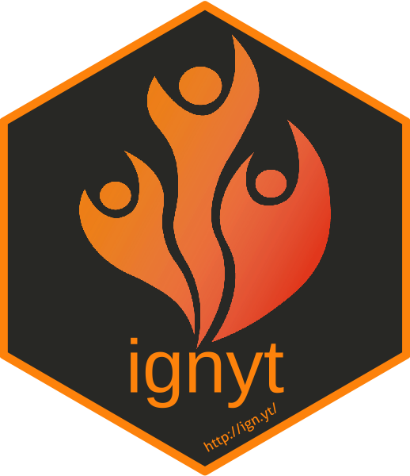

<!-- README.md is generated from README.Rmd. Please edit that file -->

# ignyt



<!-- badges: start -->

[](https://www.tidyverse.org/lifecycle/#maturing)
<!-- badges: end -->

The goal of ignyt is to provide a customizable radiology workflow
management software integrating seamlessly with existing clinical
roster, dictation and RIS/PACS software.

The corresponding scientific paper evaluating the performance of ignyt
under real-world conditions has been published in JCO:CCI: [Programmatic
implementation of a custom subspecialized oncologic imaging workflow
manager at a tertiary cancer
center](https://dx.doi.org/10.1200/CCI.22.00066)

## Installation

Ignyt can be installed directly from
[github](https://www.github.com/ignyt/ignyt_open) with:

``` r
remotes::install_git("https://www.github.com/ignyt/ignyt_open")
```

## Examples

Refer to the vignette and \*\_test.Rmd files provided with the package
for usage examples. The examples should work out of the box without
further modifications.

Note that *all data included* in the vignette and test functions is
*computer-generated* and subsequently manually curated. No actual
patient or hospital-related data has been included.

## Customization

For ignyt to work in a new production environment, all of the following
need to be modified:

-   Internal reference data in /data-raw/ directory
-   fct_pins.R: URL of internal pinboard
-   fct_dict_sys.R: Needs to be adapted to dictation system available
-   fct_prep_worklist.R, fct_readers.R and Rmd’s: Database server and
    SQL queries
